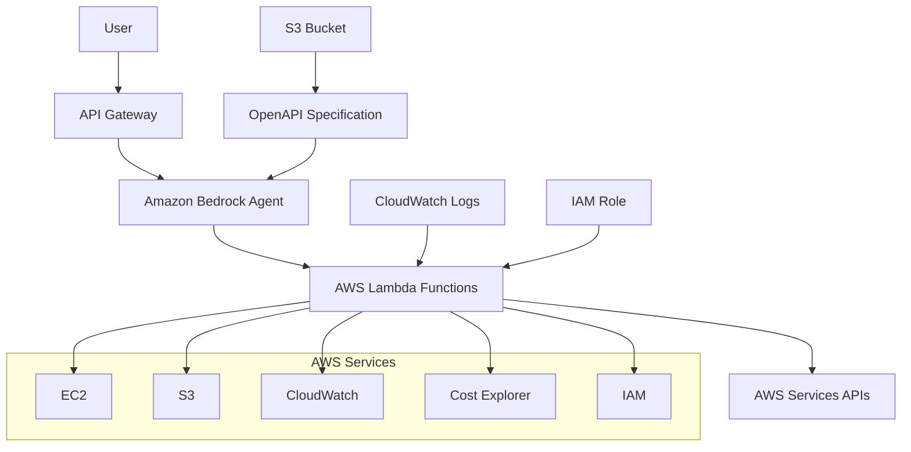

# AWS AI Concierge - Design Document

## Overview

The AWS AI Concierge is implemented as a serverless architecture leveraging Amazon Bedrock for natural language processing and AWS Lambda for executing AWS API operations. The system follows a tool-based agent pattern where the Bedrock Agent can invoke specific Lambda functions to gather AWS resource information and provide intelligent responses to user queries.

The architecture prioritizes security through read-only operations, cost efficiency through serverless compute, and extensibility through modular tool design. The initial implementation focuses on core monitoring and cost analysis capabilities, with a clear path for future enhancements.

## Architecture

### High-Level Architecture



### Component Interaction Flow

1. **User Request**: User submits natural language query via API Gateway
2. **Agent Processing**: Bedrock Agent interprets the request using Claude 3 Haiku
3. **Tool Selection**: Agent determines which Lambda functions to invoke based on OpenAPI specification
4. **Data Retrieval**: Lambda functions execute AWS API calls with read-only permissions
5. **Response Generation**: Agent synthesizes data into natural language response
6. **Audit Logging**: All operations logged to CloudWatch for compliance

### Security Architecture

- **Principle of Least Privilege**: Lambda execution role has minimal read-only permissions
- **No Data Persistence**: No user data stored beyond session context
- **Audit Trail**: Complete logging of all AWS API calls and user interactions
- **Regional Compliance**: Respects data residency requirements

## Components and Interfaces

### 1. Bedrock Agent Configuration

**Model Selection**: Claude 3 Haiku on Amazon Bedrock
- **Rationale**: Optimal balance of cost, speed, and capability for AWS operations
- **Performance**: Sub-3 second response times for simple queries
- **Cost Efficiency**: Lower token costs compared to larger models

**Agent Instructions**:
```
You are an AWS Cloud Concierge, an expert assistant for Amazon Web Services management and monitoring. Your primary goal is to help users understand, monitor, and optimize their AWS infrastructure through natural language interactions.

CORE CAPABILITIES:
- Analyze AWS costs and identify optimization opportunities
- Monitor and discover AWS resources across regions
- Provide security and compliance insights
- Translate technical AWS concepts into business-friendly language

TOOL USAGE GUIDELINES:
- Always use the most specific tool available for the user's request
- When multiple regions are involved, clearly specify which regions you're analyzing
- For cost queries, always include the time period and currency in your response
- When security issues are found, prioritize them by risk level
- If a tool returns no results, clearly state this and suggest alternative approaches

RESPONSE FORMAT:
- Use clear, business-friendly language while maintaining technical accuracy
- Always cite the specific AWS region(s) in your responses
- Provide actionable recommendations when possible
- Include relevant timestamps and metadata for context
- Format large datasets in tables or bullet points for readability

ERROR HANDLING:
- If AWS API calls fail, explain the issue in user-friendly terms
- When permissions are insufficient, specify what permissions are needed
- If services are unavailable, provide status information and alternatives
- For ambiguous requests, ask clarifying questions before proceeding

SECURITY PRINCIPLES:
- Never perform write operations without explicit user confirmation
- Always operate with read-only permissions by default
- Respect regional compliance and data residency requirements
- Log all operations for audit purposes
```

### 2. Lambda Function Architecture

**Function Organization**: Single Lambda function with multiple handlers for different AWS service categories

**Core Function Signatures**:

```python
# Cost Analysis Functions
def get_cost_analysis(time_period: str, granularity: str, group_by: str) -> dict
def get_idle_ec2_instances(region: str, cpu_threshold: float, days: int) -> dict
def get_cost_optimization_recommendations(region: str) -> dict

# Resource Discovery Functions  
def list_resources_by_type(resource_type: str, region: str) -> dict
def get_resource_details(resource_id: str, resource_type: str, region: str) -> dict
def get_resource_health_status(resource_id: str, resource_type: str, region: str) -> dict

# Security Analysis Functions
def get_security_assessment(region: str) -> dict
def check_encryption_status(resource_type: str, region: str) -> dict
def analyze_security_groups(region: str) -> dict

# General Utility Functions
def list_accessible_regions() -> dict
def get_account_summary() -> dict
```

**Boto3 Service Clients**:
- `boto3.client('ce')` - Cost Explorer for cost analysis
- `boto3.client('ec2')` - EC2 for compute resources
- `boto3.client('s3')` - S3 for storage resources  
- `boto3.client('cloudwatch')` - CloudWatch for metrics
- `boto3.client('iam')` - IAM for security analysis
- `boto3.client('support')` - Support API for recommendations

### 3. OpenAPI Specification

**Complete OpenAPI Schema** (stored in S3):

```yaml
openapi: 3.0.0
info:
  title: AWS AI Concierge Tools
  version: 1.0.0
  description: Tools for AWS resource management and monitoring

paths:
  /cost-analysis:
    post:
      summary: Analyze AWS costs and spending patterns
      operationId: getCostAnalysis
      requestBody:
        required: true
        content:
          application/json:
            schema:
              type: object
              properties:
                time_period:
                  type: string
                  enum: ["DAILY", "MONTHLY", "YEARLY"]
                  description: Time granularity for cost analysis
                granularity:
                  type: string
                  enum: ["DAILY", "MONTHLY"]
                  description: Data point granularity
                group_by:
                  type: string
                  enum: ["SERVICE", "REGION", "USAGE_TYPE"]
                  description: How to group cost data
              required: ["time_period"]
      responses:
        '200':
          description: Cost analysis results
          content:
            application/json:
              schema:
                type: object
                properties:
                  total_cost:
                    type: number
                  currency:
                    type: string
                  time_period:
                    type: string
                  breakdown:
                    type: array
                    items:
                      type: object

  /idle-resources:
    post:
      summary: Identify idle or underutilized resources
      operationId: getIdleResources
      requestBody:
        required: true
        content:
          application/json:
            schema:
              type: object
              properties:
                region:
                  type: string
                  description: AWS region to analyze
                cpu_threshold:
                  type: number
                  default: 5.0
                  description: CPU utilization threshold percentage
                days:
                  type: integer
                  default: 7
                  description: Number of days to analyze
              required: ["region"]
      responses:
        '200':
          description: List of idle resources
          content:
            application/json:
              schema:
                type: object
                properties:
                  idle_instances:
                    type: array
                    items:
                      type: object
                  potential_savings:
                    type: number
                  analysis_period:
                    type: string

  /resource-inventory:
    post:
      summary: Get inventory of AWS resources
      operationId: getResourceInventory
      requestBody:
        required: true
        content:
          application/json:
            schema:
              type: object
              properties:
                resource_type:
                  type: string
                  enum: ["EC2", "S3", "RDS", "LAMBDA", "ALL"]
                  description: Type of resources to list
                region:
                  type: string
                  description: AWS region to query
              required: ["resource_type", "region"]
      responses:
        '200':
          description: Resource inventory
          content:
            application/json:
              schema:
                type: object
                properties:
                  resources:
                    type: array
                    items:
                      type: object
                  total_count:
                    type: integer
                  region:
                    type: string

  /security-assessment:
    post:
      summary: Perform security assessment of AWS resources
      operationId: getSecurityAssessment
      requestBody:
        required: true
        content:
          application/json:
            schema:
              type: object
              properties:
                region:
                  type: string
                  description: AWS region to assess
                assessment_type:
                  type: string
                  enum: ["BASIC", "COMPREHENSIVE"]
                  default: "BASIC"
              required: ["region"]
      responses:
        '200':
          description: Security assessment results
          content:
            application/json:
              schema:
                type: object
                properties:
                  findings:
                    type: array
                    items:
                      type: object
                  risk_score:
                    type: integer
                  recommendations:
                    type: array
                    items:
                      type: string
```

## Data Models

### Cost Analysis Response Model
```python
@dataclass
class CostAnalysisResponse:
    total_cost: float
    currency: str
    time_period: str
    start_date: str
    end_date: str
    breakdown: List[CostBreakdownItem]
    
@dataclass
class CostBreakdownItem:
    service_name: str
    cost: float
    percentage: float
    usage_quantity: Optional[float]
    unit: Optional[str]
```

### Resource Inventory Model
```python
@dataclass
class ResourceInventoryResponse:
    resources: List[AWSResource]
    total_count: int
    region: str
    resource_type: str
    
@dataclass
class AWSResource:
    resource_id: str
    resource_type: str
    name: Optional[str]
    status: str
    created_date: str
    region: str
    tags: Dict[str, str]
    metadata: Dict[str, Any]
```

### Security Assessment Model
```python
@dataclass
class SecurityAssessmentResponse:
    findings: List[SecurityFinding]
    risk_score: int
    recommendations: List[str]
    assessment_date: str
    region: str
    
@dataclass
class SecurityFinding:
    finding_id: str
    severity: str  # HIGH, MEDIUM, LOW
    title: str
    description: str
    resource_id: str
    remediation_steps: List[str]
```

## Error Handling

### Error Classification and Response Strategy

**AWS API Errors**:
- `AccessDenied`: "I don't have permission to access that resource. Please ensure the IAM role has [specific permission] for [service]."
- `ThrottlingException`: "AWS is currently rate limiting requests. Please try again in [X] seconds."
- `ServiceUnavailable`: "The AWS [service] is temporarily unavailable. You can check status at https://status.aws.amazon.com/"

**User Input Errors**:
- Invalid region: "The region '[region]' is not valid. Available regions are: [list]"
- Malformed request: "I need more information. Could you specify [missing parameter]?"
- Ambiguous query: "I can help with [option A] or [option B]. Which would you prefer?"

**System Errors**:
- Lambda timeout: "The request is taking longer than expected. This might be due to a large dataset. Try narrowing your query scope."
- Memory limits: "The response dataset is too large. Please filter by region or resource type."

### Retry Logic Implementation
```python
@retry(
    stop=stop_after_attempt(3),
    wait=wait_exponential(multiplier=1, min=4, max=10),
    retry=retry_if_exception_type((ClientError, BotoCoreError))
)
def make_aws_api_call(client, operation, **kwargs):
    """Execute AWS API call with exponential backoff retry logic"""
    pass
```

## Testing Strategy

### Unit Testing Approach

**Lambda Function Testing**:
- Mock all Boto3 clients using `moto` library
- Test each function with valid inputs and expected outputs
- Test error conditions and exception handling
- Validate response schema compliance

**Test Cases by Requirement**:

1. **Cost Analysis (Requirement 1)**:
   - Test cost retrieval for different time periods
   - Verify idle resource identification logic
   - Test cost optimization recommendation generation
   - Validate currency and time period formatting

2. **Resource Discovery (Requirement 2)**:
   - Test resource listing across multiple regions
   - Verify resource detail retrieval
   - Test CloudWatch metrics integration
   - Validate metadata and timestamp inclusion

3. **Security Assessment (Requirement 3)**:
   - Test security group analysis
   - Verify encryption status checking
   - Test risk prioritization logic
   - Validate remediation step generation

### Integration Testing

**Bedrock Agent Testing**:
- Use Bedrock Agent trace functionality to verify tool invocation
- Test natural language interpretation accuracy
- Verify response formatting and user-friendliness
- Test error message translation

**End-to-End Testing Scenarios**:
1. "Show me my AWS costs for this month" → Cost analysis tool → Formatted response
2. "Are there any idle EC2 instances in us-east-1?" → Idle resource tool → Instance list with recommendations
3. "What security issues should I be concerned about?" → Security assessment tool → Prioritized findings list

### Performance Testing

**Response Time Validation**:
- Simple queries: < 5 seconds (Requirement 5.1)
- Complex queries: < 15 seconds (Requirement 5.2)
- Concurrent user testing: 10 simultaneous requests (Requirement 5.5)

**Load Testing Approach**:
- Use AWS Load Testing solution or Artillery.js
- Test API Gateway → Bedrock → Lambda chain
- Monitor CloudWatch metrics for latency and errors
- Validate auto-scaling behavior

### Security Testing

**Permission Validation**:
- Verify read-only access enforcement
- Test IAM role boundary conditions
- Validate cross-region access controls
- Test audit logging completeness

**Data Protection Testing**:
- Verify no sensitive data persistence
- Test session isolation
- Validate encryption in transit
- Test compliance with regional requirements

This design provides a comprehensive foundation for implementing the AWS AI Concierge while addressing the practical considerations you raised about scope, prioritization, and complexity management.