# AWS AI Concierge - Final Production Architecture

## 🏗️ **Hybrid Multi-Model Architecture Overview**

The AWS AI Concierge implements a groundbreaking **hybrid architecture** that combines Amazon Nova Lite's advanced reasoning with Bedrock Agent Core's reliability, delivering real-time AWS insights with zero hallucination.

### **Hybrid Multi-Model Architecture**

```mermaid
graph TB
    User[👤 User<br/>Natural Language Query] --> API[🌐 API Gateway<br/>CORS Enabled]
    
    API --> Lambda[⚡ AWS Lambda<br/>Hybrid AI Engine<br/>512MB, Python 3.11]
    
    Lambda --> NovaLite[🚀 Amazon Nova Lite<br/>Direct Integration<br/>2.7s avg response]
    Lambda --> BedrockAgent[🤖 Bedrock Agent Core<br/>Claude 3 Haiku Fallback<br/>7s avg response]
    
    Lambda --> DateParser[📅 Intelligent Date Parser<br/>Any Month/Year Support]
    
    DateParser --> CE[💰 Cost Explorer API<br/>Real Historical Data]
    Lambda --> EC2[🖥️ EC2 API<br/>Live Resource Discovery]
    Lambda --> S3[🪣 S3 API<br/>Storage Analysis]
    Lambda --> RDS[🗄️ RDS API<br/>Database Inventory]
    Lambda --> SG[🛡️ Security Groups<br/>Security Assessment]
    
    Lambda --> DDB[📊 DynamoDB<br/>Session Storage]
    Lambda --> CWLogs[📝 CloudWatch Logs<br/>Debug & Audit]
    
    IAMLambda[🔐 Lambda Role<br/>AWS Service Access] --> Lambda
    IAMBedrock[🔐 Bedrock Role<br/>Model Permissions] --> BedrockAgent
    
    Frontend[🌐 React Frontend<br/>CloudFront + S3] --> API
    
    style User fill:#e1f5fe
    style NovaLite fill:#4caf50
    style BedrockAgent fill:#ff9800
    style Lambda fill:#2196f3
    style DateParser fill:#9c27b0
    style CE fill:#e8f5e8
    style Frontend fill:#00bcd4
```

### Detailed Component Flow

### Infrastructure Components

## Cost Breakdown Visualization

## Performance Metrics

