# AWS AI Concierge - Architecture Diagrams

## Production Architecture Overview

### Mermaid Diagram Code

```mermaid
graph TB
    User[👤 User] --> Bedrock[🤖 Amazon Bedrock Agent<br/>aws-ai-concierge-dev<br/>Claude 3 Haiku]
    
    Bedrock --> Lambda[⚡ AWS Lambda<br/>aws-ai-concierge-tools-dev<br/>512MB, Python 3.11]
    
    Lambda --> CE[💰 Cost Explorer<br/>Cost Analysis]
    Lambda --> EC2[🖥️ EC2<br/>Resource Discovery]
    Lambda --> S3[🪣 S3<br/>Security Assessment]
    Lambda --> RDS[🗄️ RDS<br/>Resource Monitoring]
    Lambda --> CW[📊 CloudWatch<br/>Metrics & Health]
    
    Lambda --> CWLogs[📝 CloudWatch Logs<br/>Audit Trail]
    
    IAM[🔐 IAM Roles<br/>Read-only Permissions] --> Lambda
    IAM --> Bedrock
    
    S3Bucket[🪣 S3 Bucket<br/>OpenAPI Specs] -.-> Bedrock
    
    style User fill:#e1f5fe
    style Bedrock fill:#fff3e0
    style Lambda fill:#fff3e0
    style CE fill:#e8f5e8
    style EC2 fill:#fff3e0
    style S3 fill:#e8f5e8
    style RDS fill:#e3f2fd
    style CW fill:#f3e5f5
    style CWLogs fill:#f3e5f5
    style IAM fill:#ffebee
    style S3Bucket fill:#e8f5e8
```

### Detailed Component Flow

### Infrastructure Components

## Cost Breakdown Visualization

## Performance Metrics

